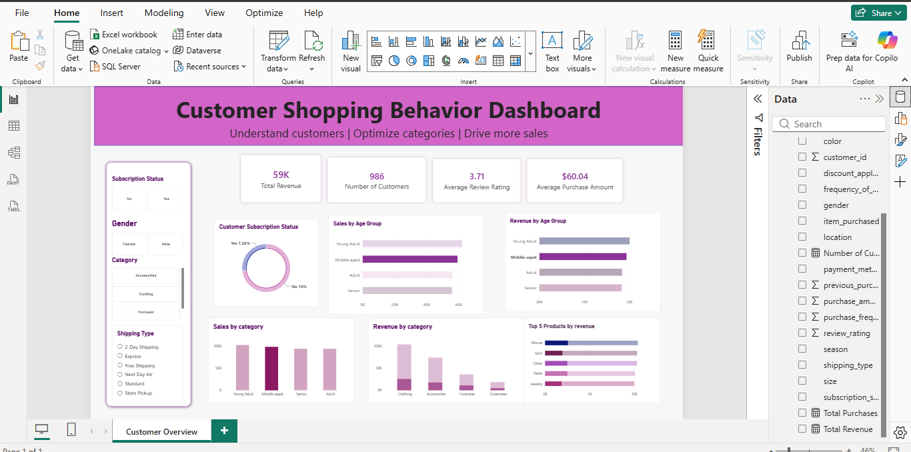

# 🛍️ Customer Shopping Behavior Analysis

> End-to-end retail data analytics project using Python, SQL, MySQL, and Power BI to analyze customer purchasing behavior, product performance, customer segments, and revenue trends.

---

## 📌 Project Overview

Customer behavior plays an important role in understanding sales performance, customer engagement, and product demand.

This project analyzes **3,900 customer shopping transactions** to identify purchasing patterns, customer segments, product performance, revenue trends, and other business insights.

The project follows an end-to-end data analytics workflow:

**Data Cleaning & Preparation → SQL Analysis → Data Modeling → Power BI Dashboard → Business Insights**

Python was used for data cleaning and transformation, MySQL was used for structured SQL analysis, and Power BI was used to build an interactive dashboard for business reporting.

---

## 🎯 Business Problem

A retail business wants to understand customer shopping behavior and identify factors that influence purchasing and revenue.

The analysis focuses on questions such as:

- Which product categories generate the highest revenue?
- Which products are performing best?
- Which customer segments contribute the most revenue?
- How does subscription status relate to customer spending?
- What is the impact of discounts on purchasing behavior?
- Which age groups contribute the most revenue?
- Which payment methods are most commonly used?
- How does purchasing behavior vary across seasons?
- Which products perform best within each category?

The objective is to convert raw customer transaction data into meaningful insights that can support:

- Sales strategy
- Marketing decisions
- Customer engagement
- Customer retention
- Product prioritization
- Promotional strategy

---

## 📊 Dataset

The dataset contains **3,900 customer shopping transactions** across **18 columns**.

### Dataset Features

- Customer ID
- Age
- Gender
- Item Purchased
- Category
- Purchase Amount (USD)
- Location
- Size
- Color
- Season
- Review Rating
- Subscription Status
- Shipping Type
- Discount Applied
- Promo Code Used
- Previous Purchases
- Payment Method
- Frequency of Purchases

---

## 🛠️ Tools & Technologies

| Technology | Purpose |
|------------|---------|
| **Python** | Data cleaning and preparation |
| **Pandas** | Data manipulation and transformation |
| **NumPy** | Numerical operations |
| **MySQL** | Data storage and SQL analysis |
| **SQL** | Business analysis and insight generation |
| **Power BI** | Interactive dashboard and visualization |
| **DAX** | KPI calculations |
| **Git & GitHub** | Version control and project sharing |

---

# 🔄 Project Workflow

```text
Raw Customer Shopping Dataset
            │
            ▼
    Data Understanding
            │
            ▼
 Data Cleaning & Validation
            │
            ▼
    Data Transformation
            │
            ▼
      Cleaned Dataset
            │
            ▼
       MySQL Database
            │
            ▼
     SQL Business Analysis
            │
            ▼
     Power BI Data Model
            │
            ▼
      DAX KPI Measures
            │
            ▼
    Interactive Dashboard
            │
            ▼
      Business Insights

---

# 📊 Power BI Dashboard

The interactive Power BI dashboard provides a consolidated view of customer shopping behavior and business performance.

### Dashboard Preview



---

# 📌 Project Outcome

This project demonstrates an end-to-end data analytics workflow, starting with raw customer shopping data and progressing through data preparation, SQL analysis, KPI development, dashboard creation, and business insight generation.

The project demonstrates practical experience in:

**Python → SQL → MySQL → Power BI → DAX → Business Insights**

It showcases the ability to transform customer transaction data into structured analysis and interactive business reporting.

---

# 👨‍💻 Author

## Souri Sarkar

**B.Tech — Computer Science & Engineering**

Aspiring **Data Analyst | Business Analyst | Data Scientist**

### Technical Skills

**Python | SQL | Power BI | Excel | Data Analysis | Machine Learning | AI**

### GitHub

[https://github.com/Souri-Sarkar](https://github.com/Souri-Sarkar)

---
